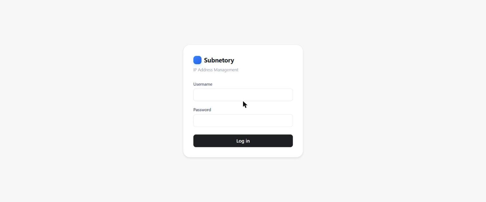
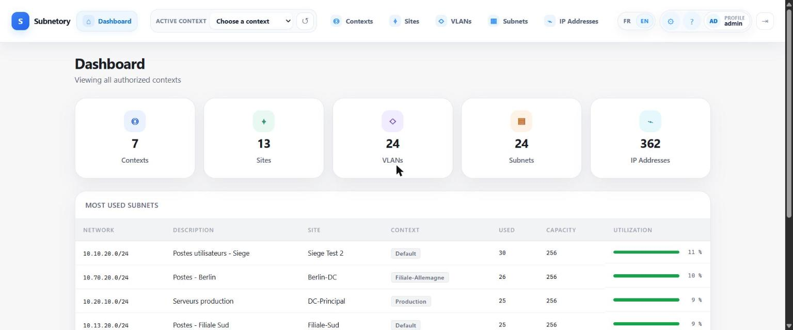
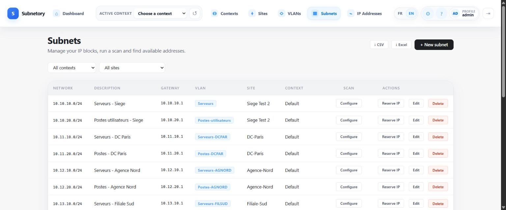
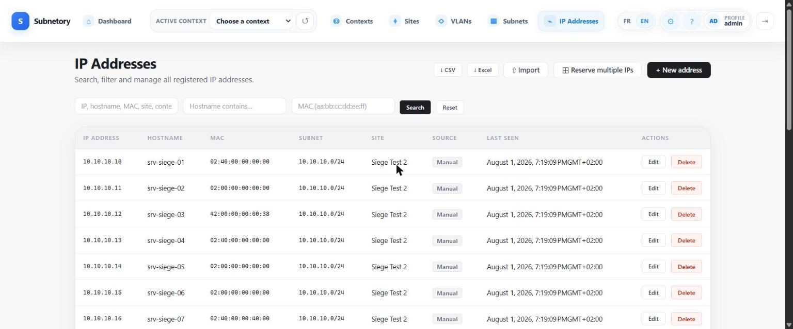
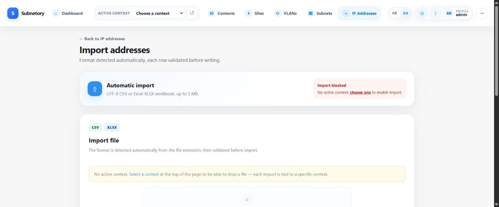
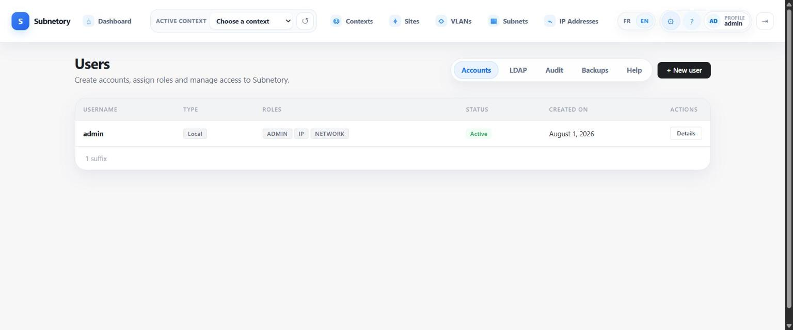

# Subnetory

Modern self-hosted IPAM.

Subnetory is a lightweight IP address management platform focused on clean infrastructure operations, API-first usage, simple deployment and reliable backup/restore workflows.

## Current release

- Current released version: `v0.8.0`
- Latest milestone: MFA, backup lifecycle (import/delete/purge/labels), backup encryption enabled by default, dependency scanning, optional HTTPS reverse-proxy overlay, generalized API rate limiting
- Publication status: merged on `main` and validated by GitHub Actions
- Backend stack: Java 21, Spring Boot, PostgreSQL, Flyway, Thymeleaf, Docker
- Repository status: public, early-stage, production-oriented MVP track

## Main capabilities

- Contexts, sites, VLANs, subnets and IP address management
- PostgreSQL native `inet`, `cidr` and `macaddr` usage
- REST API and secured web GUI
- Local authentication and optional LDAP
- CSV/XLSX import, CSV/Excel export
- OpenAPI / Swagger UI
- Docker Compose deployment
- Backup, restore, retention, scheduling and integrity checks
- GitHub Actions CI and GHCR release workflow
- Portable Windows x64 app-image with a bundled Java 21 runtime

## Screenshots

| | |
|---|---|
|  |  |
| Login | Dashboard |
|  |  |
| Subnets | IP addresses |
|  |  |
| CSV/XLSX import | User administration |

## Prerequisites

- Java 21
- Docker and Docker Compose v2 for the recommended local deployment
- PowerShell 7 (`pwsh.exe`) for Windows backup/reprise scripts

## Portable Windows distribution

Sprint 2.29 provides a Windows x64 `app-image` generated with `jlink` and `jpackage`.
The target computer does not need a separate JRE or JDK because Java 21 is bundled.
PostgreSQL 17 remains external and must be reachable from the Windows host.

Build the portable distribution from PowerShell 7:

```powershell
pwsh.exe -File .\scripts\make-jpackage.ps1
```

Generated artifacts:

- `dist/windows/subnetory-0.8.0-windows-x64/`;
- `dist/windows/subnetory-0.8.0-windows-x64.zip`;
- SHA256 and manifest files.

At first login, the local `admin` account must replace its bootstrap password.
Until that change is completed, application pages and JWT issuance remain blocked.

Detailed instructions: [`backend/docs/INSTALL_WINDOWS.md`](backend/docs/INSTALL_WINDOWS.md).

## Quick start with Docker Compose

Secrets (JWT signing key, PostgreSQL password, temporary admin password) are never stored in `.env`. Generate them first:

```bash
./scripts/init-compose.sh
```

```powershell
pwsh.exe -File .\scripts\init-compose.ps1
```

This creates the required files under `backend/secrets/`. `backend/.env.example` only holds non-sensitive defaults (`HOST_PORT`, `SERVER_PORT`, `POSTGRES_USER`); copy it to `backend/.env` only if you need to change one of those values.

```bash
cd backend
docker compose up --build
```

Application URL:

```text
http://localhost:8080
```

Health check:

```bash
curl http://localhost:8080/actuator/health
```

Expected response:

```json
{"status":"UP"}
```

## Backups

Two independent mechanisms are available — do not enable both against the same database (the Helm chart rejects the combination at render time).

**In-app backup engine** (Phase 7, 31/07/2026 audit): `pg_dump`/`pg_restore` run by the application itself, identically in Docker Compose and Kubernetes. Full admin UI (`/admin/backup`), REST API (`/api/v1/admin/backup`, see [API-first parity](backend/docs/API_FIRST_PARITY.md) and `backend/docs/ADMIN_GUIDE.md`), per-run history, SHA-256 checksum verification, and an automatic safety backup before every restore (never a single click — see `backend/docs/RESTORE_OPERATIONS.md`).

**Kubernetes CronJob mechanism** (legacy, kept for existing deployments): the Helm chart also supports opt-in scheduled backups for its included PostgreSQL via standalone CronJobs. Backups are disabled by default, stored on a dedicated or pre-existing PVC, checked with gzip, the PostgreSQL archive catalogue and SHA256, then rotated independently by schedule level.

The restore drill is non-destructive: it mounts the backup PVC read-only and restores into an isolated temporary PostgreSQL using a non-superuser role. It rejects path traversal, malformed checksums, level confusion and injected Kubernetes identifiers.

Start with:

- [Kubernetes installation](backend/docs/INSTALL_KUBERNETES.md)
- [Kubernetes operations](backend/docs/KUBERNETES_OPERATIONS.md)
- [Kubernetes/Helm readiness](backend/docs/KUBERNETES_HELM_READINESS.md)
- [API-first parity](backend/docs/API_FIRST_PARITY.md)

A PVC in the same cluster is not an off-site backup. Production operation still requires protected storage in an independent failure domain and verified NetworkPolicy enforcement by the target CNI.

## Run tests

PowerShell:

```powershell
cd backend
.\mvnw.cmd test
```

Bash:

```bash
cd backend
./mvnw test
```

The full test suite runs on every push and pull request via the GitHub Actions `test` job — check that workflow's latest run for the current pass/fail count rather than a number frozen in this file.

## Reprise archive

Reprise archives must be generated with the versioned script:

```powershell
pwsh.exe -File scripts/make-reprise-archive.ps1
```

Important rule:

- Never commit or archive database dumps (`*.sql.gz`, `*.dump`, `backups/`).
- Flyway migrations under `backend/src/main/resources/db/migration/*.sql` are source code and must always be present.

## Documentation

- Backend documentation index: [backend/docs/README.md](backend/docs/README.md)
- Backup strategy: [backend/docs/BACKUP_STRATEGY.md](backend/docs/BACKUP_STRATEGY.md)
- Restore operations: [backend/docs/RESTORE_OPERATIONS.md](backend/docs/RESTORE_OPERATIONS.md)
- User guide MVP: [backend/docs/USER_GUIDE_MVP.md](backend/docs/USER_GUIDE_MVP.md)
- Changelog: [CHANGELOG.md](CHANGELOG.md)

